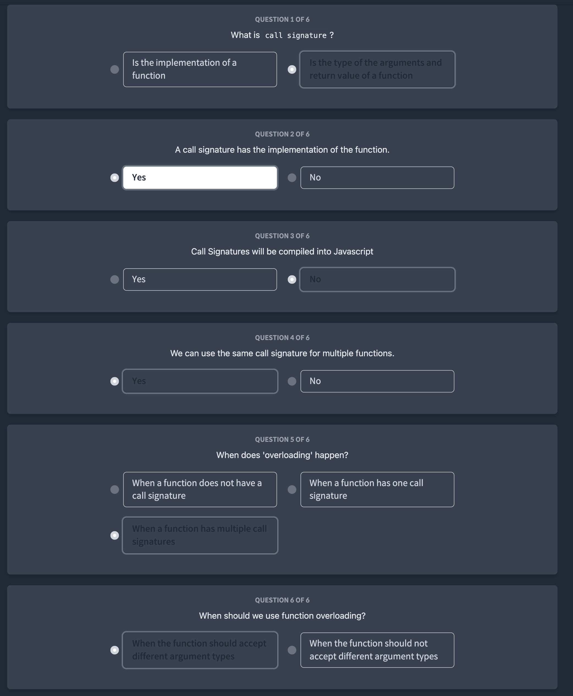

# 使用方法

ターミナルで以下のコマンドを実行して、サーバを起動します:

```bash
bash start.sh [front|back]
```

````
ここで、start.shは実行するスクリプトファイル名で、[front|back]は、フロントエンドまたはバックエンドサーバを起動する引数です。引数が無効な場合や指定がない場合は、エラーメッセージが表示されます。

たとえば、バックエンドサーバを起動する場合は、以下のコマンドを実行します:
```bash
bash start.sh back
````

このスクリプトは、バックグラウンドで指定されたサーバを起動し、すべてのバックグラウンドタスクが完了するまで待機します。最後に、すべてのコマンドが完了したことを示すメッセージが表示されます。 `All commands have finished!`

サーバを停止する場合は、以下のコマンドを実行します:

```bash
bash end.sh [front|back]
```

ここで、end.sh はスクリプトファイル名で、[front|back]は、停止するサーバを指定する引数です。起動時に指定した引数を指定してください。このスクリプトは、指定されたサーバを停止し、すべてのコマンドが完了したことを示すメッセージが表示されます。

# Typescript beginners





